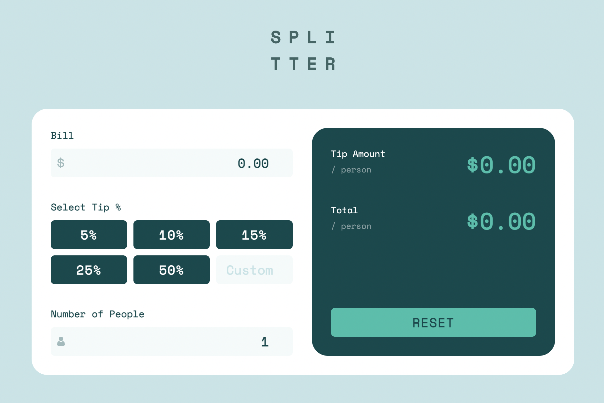

# Tip Calculator

This is a solution to the [Tip calculator app challenge on Frontend Mentor](https://www.frontendmentor.io/challenges/tip-calculator-app-ugJNGbJUX).

## Screenshot

## Links

- Live Site URL: Coming soon

## Built with

- [React](https://reactjs.org/) - for the UI
- [TypeScript](https://www.typescriptlang.org/) - for typing
- [SCSS](https://sass-lang.com/) - for styling
- [Parcel](https://parceljs.org/) - for zero-config bundling
- [Vercel](https://vercel.com/) - for hosting
